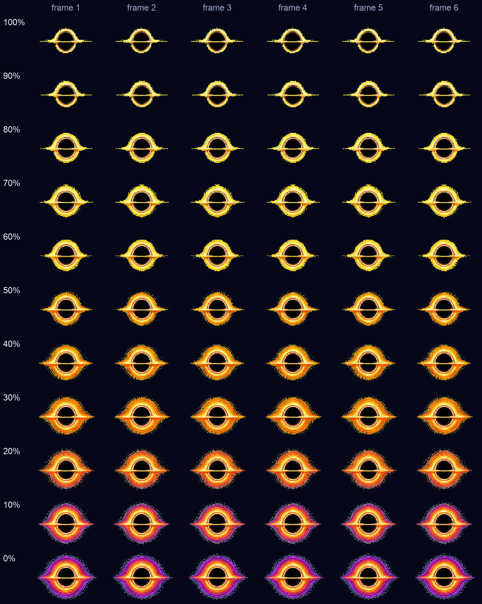
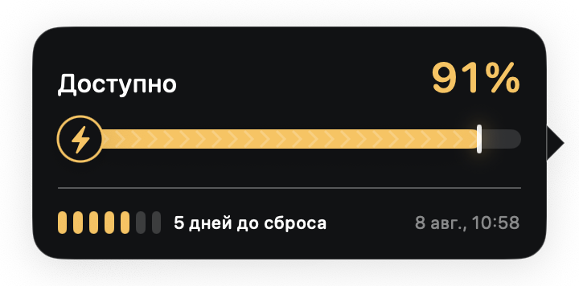

# Black Hole Codex Quota Indicator

A native macOS floating pet that represents the remaining Codex quota as an
animated black-hole accretion disk.

The app reads the main Codex rate-limit bucket from the locally installed Codex
App Server. It renders the live value as a transparent, always-on-top black hole
whose accretion disk grows and accumulates gold, orange, and purple color layers.
Hovering the pet shows a localized quota card with the exact percentage, reset
time, a dynamic day countdown, and a progress bar whose appearance reflects
Standard or Turbo mode; detailed status remains available from the menu bar.
The app also reads the effective Codex
service tier: Fast/Turbo rotates 1.5 times faster and adds a pulse, while Reduce
Motion freezes both effects. The menu can hide or restore the pet and optionally
hide it while another application is fullscreen. If the local Codex process
stops, the pet reconnects automatically and the menu offers an immediate retry.
The menu also controls whether the main app launches when the user logs in.
VoiceOver announces the exact quota, speed mode, and connection state. Standard
mode updates only when its pixel-art frame changes; Turbo keeps a smooth 30 fps
pulse, and Reduce Motion freezes both effects.

The renderer uses a compact pixel-art style. Its three color layers rotate and
animate independently around a fixed black core.

## Quota states

The exact remaining quota is mapped to the nearest 10% visual state. Every state
uses six aligned animation frames, while the black core stays the same size.

<p align="center">
  
</p>

| Remaining quota | Accretion disk |
| --- | --- |
| 100–60% | The gold layer grows as quota is consumed. |
| 50–30% | An orange layer appears and becomes more prominent. |
| 20–0% | A purple outer layer progressively opens around the disk. |

Standard mode advances the six-frame loop at the normal rate. Turbo mode uses
the same quota state, rotates 1.5 times faster, and adds a pulse. Hovering the
pet always shows the exact percentage, so values between the 10% art states are
not lost.

## Quota tooltip

The tooltip follows the pet, chooses a visible side of the screen automatically,
and stays hidden while the pet is being dragged.

<p align="center">
  
</p>

1. **Available quota** — the live percentage from the primary Codex rate-limit
   bucket. The value and bar use gold at 30% and above, orange from 10–29%, and
   purple below 10%.
2. **Mode-aware progress bar** — Standard uses a smooth bar; Turbo adds the
   lightning badge, chevrons, and a brighter leading edge. The mode comes from
   the active Codex service tier rather than from the percentage.
3. **Reset window** — segmented marks show the remaining days within the real
   quota window, followed by a localized countdown and reset date/time.

## Languages

| Language | Tooltip | Menu bar | Dates and plurals |
| --- | --- | --- | --- |
| English | Yes | Yes | Localized |
| Russian / Русский | Yes | Yes | Localized |

The app follows the preferred macOS application language automatically, with
English as the fallback. Quota details, menu commands, day counts, date/time
formatting, and VoiceOver labels use the selected locale.

Product decisions are recorded in `docs/PRODUCT_SPEC.md`, and the technical
boundary is recorded in `docs/ARCHITECTURE.md`.

## Requirements

- macOS 14 or newer
- Apple silicon for the `v0.1.0` preview build
- A locally installed and authenticated Codex CLI

## Install the private preview

1. Download and unzip the release archive.
2. Move `Black Hole Codex Quota Indicator.app` to `/Applications`.
3. Open the app. Because the private preview is not notarized, macOS may require
   one-time approval in **System Settings → Privacy & Security → Open Anyway**.

Do not disable Gatekeeper. The app can enable Launch at Login from its menu
after it is installed in `/Applications`.

## Local verification

```sh
./script/build_and_run.sh --verify
```

Run the unit tests with:

```sh
xcodebuild -project 'Black Hole Codex Quota Indicator.xcodeproj' \
  -scheme 'Black Hole Codex Quota Indicator' \
  -configuration Debug \
  -derivedDataPath 'build/DerivedData' \
  -destination 'platform=macOS' \
  CODE_SIGNING_ALLOWED=NO \
  test
```
