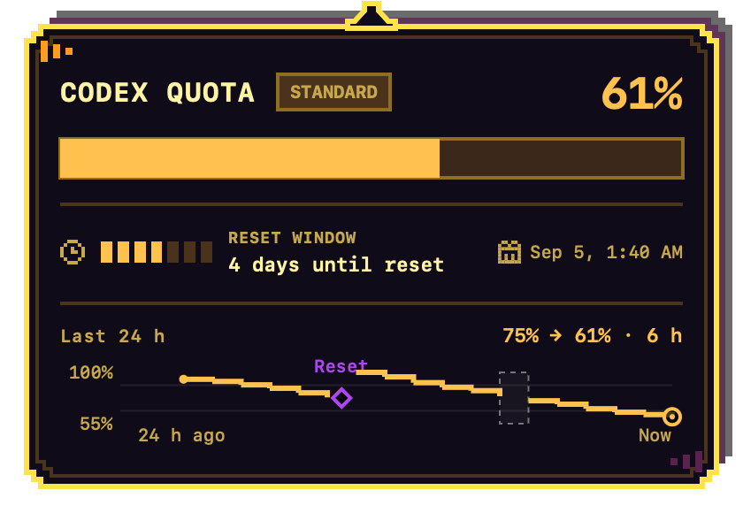
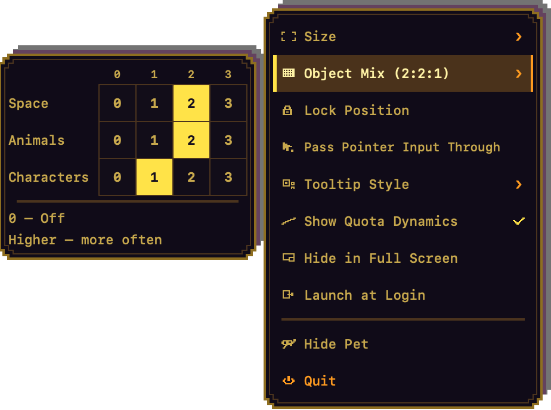
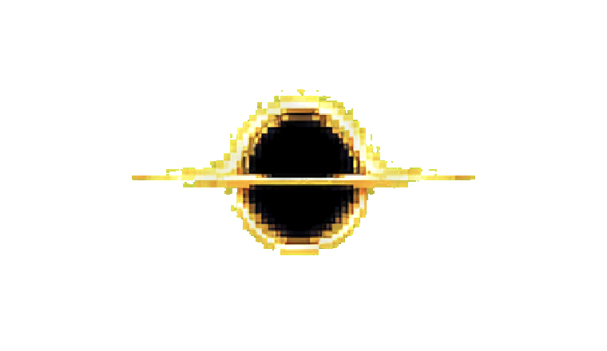

# Black Hole Codex Quota Indicator


[](https://github.com/danya-kim99/codex-quota-pet/releases/latest)

> **Your Codex quota, alive on your desktop.**

Black Hole is a native macOS companion that turns your remaining Codex quota
into an animated, always-on-top pixel-art black hole. See your remaining quota
in the accretion disk at a glance, hover for exact numbers, or open the menu for
full control—without leaving your work.

<table>
  <tr>
    <td align="center">
      <picture>
        <source media="(prefers-reduced-motion: reduce)" srcset="Assets/Sprites/frames/quota-100-frame-0.png">
        
      </picture><br><strong>100% remaining</strong>
    </td>
    <td align="center">
      <picture>
        <source media="(prefers-reduced-motion: reduce)" srcset="Assets/Sprites/frames/quota-50-frame-0.png">
        
      </picture><br><strong>50% remaining</strong>
    </td>
    <td align="center">
      <picture>
        <source media="(prefers-reduced-motion: reduce)" srcset="Assets/Sprites/frames/quota-0-frame-0.png">
        
      </picture><br><strong>0% remaining</strong>
    </td>
  </tr>
</table>

**[Download the latest preview](https://github.com/danya-kim99/codex-quota-pet/releases/latest)** · [View all releases](https://github.com/danya-kim99/codex-quota-pet/releases) · [Report an issue](https://github.com/danya-kim99/codex-quota-pet/issues)

## Why Black Hole?

Quota should be ambient information, not another dashboard you have to remember
to open. Black Hole makes it visible, useful, and a little delightful:

- **See quota instantly.** The disk changes color and shape as your available
  quota falls, while hovering reveals the exact percentage and reset time.
- **Understand the trend.** An optional local 24-hour chart shows the quota
  movement your Mac actually observed, with honest gaps and reset markers.
- **Stay in flow.** Use the native menu bar or secondary-click the pet for a
  custom pixel menu with the controls you need most.
- **Make it yours.** Pick a size, choose a Smooth or Pixel tooltip style, tune
  the absorbable Object Mix, lock the pet, or pass clicks through it.
- **Keep it local.** The app uses your installed Codex process and adds no
  separate account, backend, analytics, cloud sync, or telemetry of its own.
- **Enjoy the details.** Turbo motion, authored quota reactions, playful object
  absorption, English and Russian localization, VoiceOver, and Reduce Motion
  are built in.

## Download and install

You need:

- macOS 14 or newer
- An Apple silicon Mac
- A locally installed and authenticated Codex CLI

Install the preview:

1. Download the latest app archive from [GitHub Releases](https://github.com/danya-kim99/codex-quota-pet/releases/latest).
2. Unzip it and move `Black Hole Codex Quota Indicator.app` to `/Applications`.
3. Open the app.

Once installed in `/Applications`, the app can enable **Launch at Login** from
its menu.

You can also ask a Codex agent to install it:

> Install the latest release of Black Hole Codex Quota Indicator from
> https://github.com/danya-kim99/codex-quota-pet. Download the app archive and
> matching `.sha256` file, verify the checksum, install the app in
> `/Applications`, and launch it. Ask before replacing an existing installation,
> then report the installed version and path.

## A quota you can see

The black hole reads the primary rate-limit window from the local Codex App
Server. Eleven hand-built states map the remaining quota to the nearest 10%,
while the tooltip always keeps the exact value visible.

The disk slows as quota runs out. Turbo spins 1.5× faster and adds a pulse;
Reduce Motion freezes both. When quota drops, handcrafted pixel reactions
play—including the **Last Light** sequence at 0%—without adding quota reads.

## Local quota dynamics

Enable **Show Quota Dynamics** to add a truthful view of recent quota movement
to either tooltip style:

- Medium and large pets show the latest 24 hours as an adaptive chart.
- Small pets show the same trend as a compact text summary.
- Smooth uses an antialiased line; Pixel uses a stepped arcade-style line.
- Resets are marked explicitly, and missing continuity stays visible as a gap.
- Relaunching, reconnecting, or waking the Mac never invents activity between
  observations.



*Pixel tooltip: exact quota, reset timing, and a locally observed trend in one
hover.*

History contains only locally observed integer percentages, timestamps, and the
minimum window metadata needed to compare samples. It does not claim exact token
usage or complete account activity. The app retains up to 30 days or 2,000
snapshots in its own Application Support directory, never uploads them, and
offers **Clear Local History…** with confirmation from the menu bar.

Hiding the chart changes presentation only; local collection continues so the
trend is ready when you show it again.

## Smooth information, pixel personality

Hover the pet for the exact remaining quota, Standard or Turbo mode, reset
countdown, reset date, stale-state treatment, and optional local dynamics. The
card automatically chooses a visible side of the screen and stays out of the
way while you drag the pet.

Choose **Tooltip Style → Smooth** for the native rounded card or **Tooltip Style
→ Pixel** for an arcade-style pixel card in the black hole's gold, orange, and
purple palette. The choice is saved and can be changed from either menu.

## Two menus, zero detours

| Surface | What it gives you |
| --- | --- |
| Menu bar | Exact primary quota, secondary quota when available, reset details, mode, connection status, retry, every preference, and local-history controls. |
| Pixel context menu | Secondary-click or Control-click the visible black hole for a screen-aware animated menu with the most-used controls. |



*Object Mix lives directly in the Pixel menu—no separate settings window
required.*

The menu bar can show or hide the pet; the pixel menu can hide it. Both let you
choose S/M/L, configure Object Mix, lock the position, enable click-through,
switch tooltip style, toggle quota dynamics, hide in full screen, manage Launch
at Login, and quit. The pixel menu supports arrow keys, Return, Space, Escape,
VoiceOver, and a stepped alternative to its reversible spaghettification
animation when Reduce Motion is enabled.

## A tiny black hole with an appetite

Click the black-hole core to pull in a random pixel-art object. The catalog
contains 33 space objects, cute animals, and characters. Rapid clicks can launch
up to three at once along different curved paths, ending in gravitational
stretching and a pixel-breakup finish.

Use **Object Mix** to change how often Space, Animals, and Characters appear—or
turn a category off entirely while keeping at least one category active.


## Built for the desktop



- Transparent, always-on-top native macOS panel
- Persistent S, M, and L sizes
- Position lock and multi-display position restoration
- Optional click-through for working underneath the pet
- Optional automatic hiding while another app is full screen
- Automatic Codex reconnection with an immediate manual retry
- Standard and Turbo presentation with system Reduce Motion support
- English and Russian localization with localized dates and plurals
- VoiceOver summaries for quota, mode, history, and connection state

## Privacy

Black Hole talks to the locally installed `codex app-server` process over
standard input/output. It does not scrape the Codex interface, prompts,
conversations, credentials, or private files. It adds no project backend,
analytics, telemetry, cloud sync, or third-party dependency for quota history.

## Update

Updating keeps saved settings and local quota history:

1. Download and unzip the latest archive from [GitHub Releases](https://github.com/danya-kim99/codex-quota-pet/releases/latest).
2. Quit the running app from its menu.
3. Replace the existing app in `/Applications` and open the new copy.

## Development

Build, launch, and verify the local Debug app:

```sh
./script/build_and_run.sh --verify
```

Run the unit tests:

```sh
xcodebuild -project 'Black Hole Codex Quota Indicator.xcodeproj' \
  -scheme 'Black Hole Codex Quota Indicator' \
  -configuration Debug \
  -derivedDataPath 'build/DerivedData' \
  -destination 'platform=macOS' \
  CODE_SIGNING_ALLOWED=NO \
  test
```

Product behavior is documented in [`docs/PRODUCT_SPEC.md`](docs/PRODUCT_SPEC.md),
and technical boundaries live in [`docs/ARCHITECTURE.md`](docs/ARCHITECTURE.md).

## Feedback and contact

I'm always happy to hear feedback, ideas, and feature requests. [Open a GitHub
issue](https://github.com/danya-kim99/codex-quota-pet/issues) or message me on
Telegram: [@dkim99](https://t.me/dkim99).

**Installed Black Hole?** You're invited to join its tiny universe. This is an
exclusive perk for app users: after installing the app, send me a photo of
yourself on Telegram or through another contact channel listed here, and I'll
be happy to turn you into a new pixel-art character for a future update. For
private photos, Telegram is best because GitHub issues are public.

Created and maintained by [Daniil Kim](https://github.com/danya-kim99).

## License

Copyright © 2026 Daniil Kim. All rights reserved.

The source code, documentation, and visual assets are proprietary. Official
compiled releases may be used unmodified for personal, non-commercial use. See
[`LICENSE`](LICENSE) for the complete terms.

## Windows

[](https://github.com/Demian87/codex-quota-pet-win)

**On Windows?** My good friend [Demian87](https://github.com/Demian87) created
[Quota Wisp for Windows](https://github.com/Demian87/codex-quota-pet-win), an
original Windows version inspired by this project—with quota-aware moon phases,
a hover dashboard, local history, and an optional pixel look.
