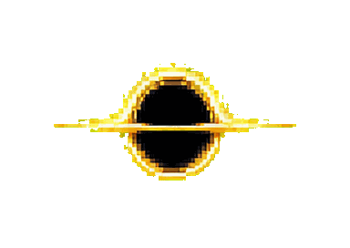
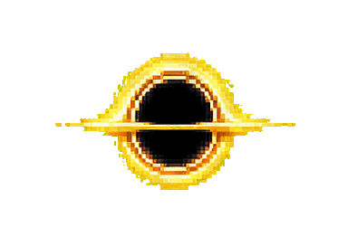
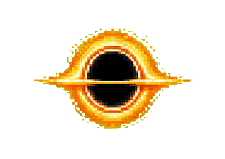
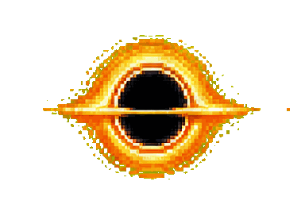
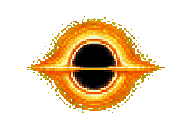
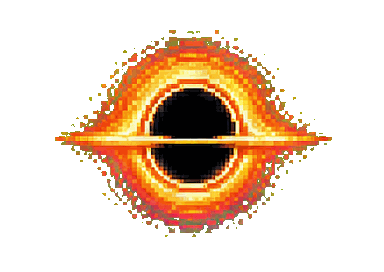
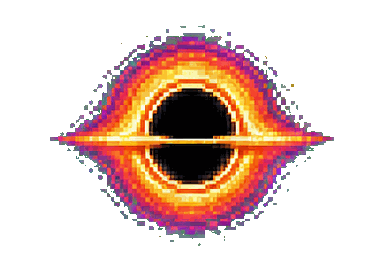
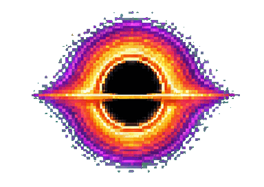
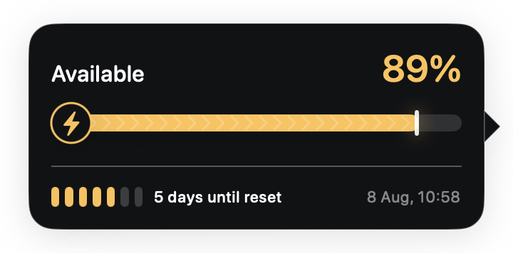
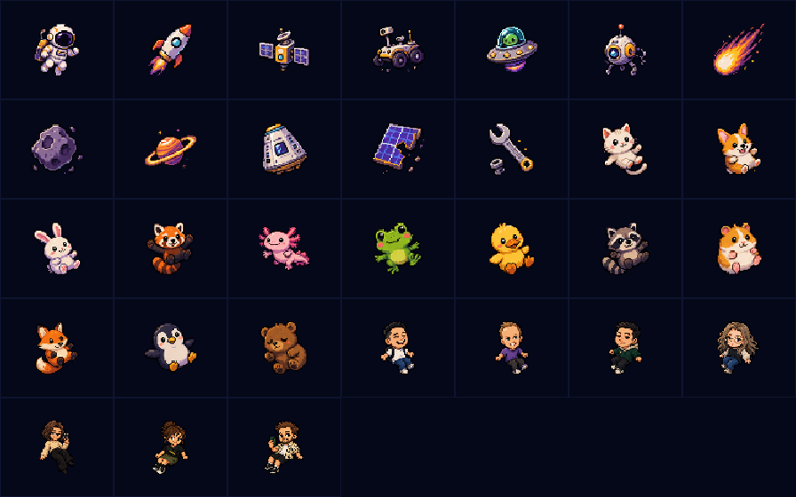

# Black Hole Codex Quota Indicator

A native macOS floating pet that represents the remaining Codex quota as an
animated black-hole accretion disk.

The app reads the main Codex rate-limit bucket from the locally installed Codex
App Server. It renders the live value as a transparent, always-on-top black hole
whose accretion disk grows and accumulates gold, orange, and purple color layers.
Hovering the pet shows a localized quota card with the exact percentage, reset
time, a dynamic day countdown, and a progress bar whose appearance reflects
Standard or Turbo mode; detailed status remains available from the menu bar.
The app also reads the effective Codex
service tier: Fast/Turbo rotates 1.5 times faster and adds a pulse, while Reduce
Motion freezes both effects. The menu can hide or restore the pet and optionally
hide it while another application is fullscreen. If the local Codex process
stops, the pet reconnects automatically and the menu offers an immediate retry.
The menu also controls whether the main app launches when the user logs in.
It also offers persistent S (240 × 132 pt), M (320 × 176 pt), and
L (400 × 220 pt) pet sizes; the quota tooltip adapts to the pet size, while
absorbed objects remain 48 × 48 pt at every size.
VoiceOver announces the exact quota, speed mode, and connection state. Standard
mode updates only when its pixel-art frame changes; Turbo keeps a smooth 30 fps
pulse, and Reduce Motion freezes both effects.

The renderer uses a compact pixel-art style. Its three color layers rotate and
animate independently around a fixed black core.

## Quota states

The exact remaining quota is mapped to the nearest 10% visual state. Each GIF
previews the complete six-frame loop, while the black core stays the same size.

<table>
  <tr>
    <td align="center"><br><strong>100%</strong></td>
    <td align="center"><br><strong>90%</strong></td>
    <td align="center"><br><strong>80%</strong></td>
    <td align="center"><br><strong>70%</strong></td>
  </tr>
  <tr>
    <td align="center"><br><strong>60%</strong></td>
    <td align="center"><br><strong>50%</strong></td>
    <td align="center"><br><strong>40%</strong></td>
    <td align="center"><br><strong>30%</strong></td>
  </tr>
  <tr>
    <td align="center"><br><strong>20%</strong></td>
    <td align="center"><br><strong>10%</strong></td>
    <td align="center"><br><strong>0%</strong></td>
  </tr>
</table>

| Remaining quota | Accretion disk |
| --- | --- |
| 100–60% | The gold layer grows as quota is consumed. |
| 50–30% | An orange layer appears and becomes more prominent. |
| 20–0% | A purple outer layer progressively opens around the disk. |

Standard mode advances the six-frame loop at the normal rate. Turbo mode uses
the same quota state, rotates 1.5 times faster, and adds a pulse. Hovering the
pet always shows the exact percentage, so values between the 10% art states are
not lost.

## Quota tooltip

The tooltip follows the pet, chooses a visible side of the screen automatically,
and stays hidden while the pet is being dragged.

<p align="center">
  
</p>

1. **Available quota** — the live percentage from the primary Codex rate-limit
   bucket. The value and bar use gold at 30% and above, orange from 10–29%, and
   purple below 10%.
2. **Mode-aware progress bar** — Standard uses a smooth bar; Turbo adds the
   lightning badge, chevrons, and a brighter leading edge. The mode comes from
   the active Codex service tier rather than from the percentage.
3. **Reset window** — segmented marks show the remaining days within the real
   quota window, followed by a localized countdown and reset date/time.

## Pixel context menu

Secondary-click the visible black hole or accretion disk with a mouse, trackpad,
or Control-click to open a custom pixel-art menu. It provides the current
frequently used controls without repeating quota details: conditional retry,
S/M/L size selection, fullscreen hiding, launch at login, hiding the pet, and
quitting the app. Setting toggles update their checkmarks without closing the
menu.

The menu uses the black hole's gold, orange, and purple palette with a reversible
spaghettification animation. It stays on screen near the pointer, supports
keyboard navigation and VoiceOver, respects Reduce Motion, and is localized in
English and Russian.

## Languages

| Language | Tooltip | Menu bar | Context menu | Dates and plurals |
| --- | --- | --- | --- | --- |
| English | Yes | Yes | Yes | Localized |
| Russian / Русский | Yes | Yes | Yes | Localized |

The app follows the preferred macOS application language automatically, with
English as the fallback. Quota details, menu commands, day counts, date/time
formatting, and VoiceOver labels use the selected locale.

Product decisions are recorded in `docs/PRODUCT_SPEC.md`, and the technical
boundary is recorded in `docs/ARCHITECTURE.md`.

## Optional pixel-art interaction

Click the black hole to pull in a random pixel-art object. The v0.2.0 catalog
contains 28 space objects, cute animals, and characters. Rapid clicks can launch
up to three objects at once along different trajectories, with gravitational
stretching and a pixel-breakup finish.

<p align="center">
  
</p>

## Copyright

Copyright © 2026 Daniil Kim. All rights reserved.

The source code, documentation, and visual assets are proprietary. See
[`LICENSE`](LICENSE) for the terms of use.

## Requirements

- macOS 14 or newer
- Apple silicon for the current preview build
- A locally installed and authenticated Codex CLI

## Install the preview

### Manually

1. Download and unzip the release archive.
2. Move `Black Hole Codex Quota Indicator.app` to `/Applications`.
3. Open the app.

The app can enable Launch at Login from its menu after it is installed in
`/Applications`.

### With a Codex agent

Start a local Codex task and paste this prompt:

> Install the latest release of Black Hole Codex Quota Indicator from
> https://github.com/danya-kim99/codex-quota-pet. Download the
> app archive and matching `.sha256` file, verify the checksum, install the app
> in `/Applications`, and launch it. Ask before replacing an existing
> installation. Report the installed version and path.

## Update the preview

Updating the application does not remove its saved settings.

### Manually

1. Download the latest `.zip` archive from the
   [GitHub releases page](https://github.com/danya-kim99/codex-quota-pet/releases/latest).
2. Unzip the archive.
3. Quit the currently running app from its menu bar menu.
4. Replace `/Applications/Black Hole Codex Quota Indicator.app` with the newly
   unzipped app.
5. Open the updated app and confirm its version in Finder with **Get Info**.

### With a Codex agent

Start a local Codex task and paste this prompt:

> Update Black Hole Codex Quota Indicator to the latest release from
> https://github.com/danya-kim99/codex-quota-pet. Check and report the currently
> installed version first. Download the latest Apple-silicon app archive and
> matching `.sha256` file, verify the checksum, and inspect the extracted app
> version. Ask before quitting or replacing the existing app in `/Applications`.
> After approval, replace it, launch the updated app, verify that its process is
> running, and report the installed version and path. Do not delete the saved
> application preferences.

## Local verification

```sh
./script/build_and_run.sh --verify
```

Run the unit tests with:

```sh
xcodebuild -project 'Black Hole Codex Quota Indicator.xcodeproj' \
  -scheme 'Black Hole Codex Quota Indicator' \
  -configuration Debug \
  -derivedDataPath 'build/DerivedData' \
  -destination 'platform=macOS' \
  CODE_SIGNING_ALLOWED=NO \
  test
```

## Automated CI and preview releases

GitHub Actions runs the unit tests on every pull request and every push to
`main`. Preview packaging and publishing are also handled by the same
`CI and Release` workflow on an Apple-silicon macOS runner.

To publish a stable preview:

1. Update `MARKETING_VERSION` and `CURRENT_PROJECT_VERSION` in the Xcode project.
2. Commit and push the release changes to `main`, then wait for CI to pass.
3. Open **Actions → CI and Release → Run workflow**, keep the `main` branch, and
   enter the version without the `v` prefix, for example `0.4.0`.
4. Wait for the workflow to test, build, ad-hoc sign, validate, package, checksum,
   tag, and publish the GitHub Release.

The workflow rejects releases from another branch, invalid or existing versions,
a version that differs from the app bundle, and non-arm64 output. GitHub receives
write permission only for the manual release job. Developer ID signing and Apple
notarization remain outside the current preview flow.

For a Codex agent, use this prompt:

> Prepare a new stable preview release of Black Hole Codex Quota Indicator.
> Determine the SemVer version, update `MARKETING_VERSION` and increment
> `CURRENT_PROJECT_VERSION`, then commit and push the release changes to `main`.
> Do not build, sign, package, checksum, tag, or publish locally. Wait for the
> `CI and Release` workflow on `main` to pass, then dispatch that workflow from
> `main` with the version number without a `v` prefix. Wait for completion and
> report the GitHub Release URL, version, build number, two uploaded assets, and
> published ZIP digest. If CI or publishing fails, inspect the Actions logs and
> fix the root cause instead of creating a local release.
